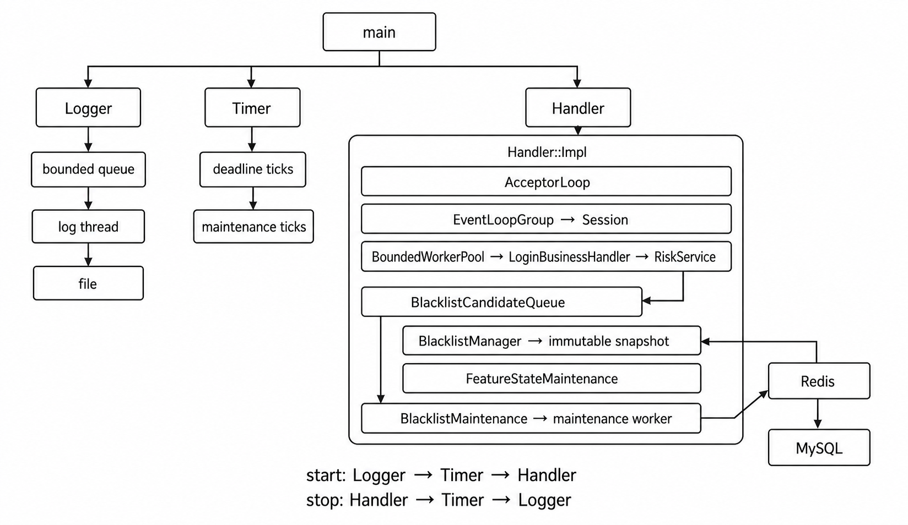

# AegisFlow C++实时风控决策引擎

AegisFlow C++实时风控决策引擎是一个面向登录场景的实时风控决策引擎。它在 Linux 上用原生 `epoll` 接收长度前缀 Protobuf 请求，在有界 WorkerPool 中更新滑动特征、查询不可变黑名单快照并执行固定策略链，返回 `PASS`、`REVIEW` 或 `REJECT`。策略产生的临时黑名单候选先进入有界内存队列，再由单线程维护任务写入 Redis，并通过 pending Stream 事务回写 MySQL。



组件所有权和并发不变量见[架构说明](docs/ARCHITECTURE.md)，按请求与实验阅读源码见[学习手册](docs/LEARNING.md)。

## 依赖与构建

运行平台为 Linux。构建需要 CMake 3.20+、支持 C++17 的编译器、Protobuf、MySQL/MariaDB client、hiredis 和 pthread。Ubuntu/Debian 可安装：

```bash
sudo apt update
sudo apt install -y cmake g++ protobuf-compiler libprotobuf-dev \
  default-libmysqlclient-dev libhiredis-dev redis-server
```

项目、压测客户端和模块测试使用互相独立的构建目录。服务及运维客户端：

```bash
./scripts/build.sh project
```

原生压测客户端与 FeatureStore 微基准：

```bash
./scripts/build.sh benchmark
```

两次命令默认分别写入 `/tmp/aegisflow-build-$UID/project-release` 和 `/tmp/aegisflow-build-$UID/benchmark-release`。模块测试使用 `/tmp/aegisflow-build-$UID/tests-debug`，不会顺带生成服务或压测可执行文件。可用 `BUILD_ROOT` 改共同根目录，或用 `BUILD_DIR` 精确指定当前命令的目录。

直接使用 CMake 时显式选择一个构建组：

```bash
cmake -S . -B /tmp/aegisflow-project \
  -DCMAKE_BUILD_TYPE=Release \
  -DAEGISFLOW_BUILD_PROJECT=ON \
  -DAEGISFLOW_BUILD_BENCHMARK=OFF \
  -DAEGISFLOW_BUILD_TESTS=OFF
cmake --build /tmp/aegisflow-project --target AegisFlow --parallel
```

顶层 CMake 只负责公共 Protobuf、构建组选项和按组装配；服务与测试复用的生产源文件清单位于 `cmake/AegisFlowServiceSources.cmake`，具体 target 分别位于 `cmake/AegisFlowProject.cmake`、`cmake/AegisFlowBenchmark.cmake`、`cmake/AegisFlowTests.cmake`。project 与 tests 组查找 MySQL/hiredis；纯 benchmark 配置只需要 Protobuf 和 Threads。

构建组与主要 target：

| 构建组 | Target | 用途 |
|---|---|---|
| project | `AegisFlow` | 实时风控决策服务 |
| project | `send_event` | 单请求协议客户端 |
| project | `manage_blacklist` | 黑名单 add、disable、clear 管理工具 |
| benchmark | `benchmark_native` | TCP + Protobuf 端到端压测客户端 |
| benchmark | `benchmark_feature_store` | FeatureStore 单线程微基准 |
| tests | `test_*` | 25 个按模块拆分的测试 target |

## 初始化 MySQL 与 Redis

在空库执行完整表结构，可选导入学习数据：

```bash
mysql -u root -p < config/schema.sql
mysql -u root -p < config/seed.sql
```

`schema.sql` 创建三张 InnoDB 表：

| 表 | 实体列 | 唯一键 | 冷启索引 |
|---|---|---|---|
| `risk_blacklist_user` | `user_id VARCHAR(128)` | `uk_blacklist_user(user_id)` | `idx_blacklist_user_active_expire(enabled, expire_at, id)` |
| `risk_blacklist_ip` | `ip VARBINARY(16)` | `uk_blacklist_ip(ip)` | `idx_blacklist_ip_active_expire(enabled, expire_at, id)` |
| `risk_blacklist_device` | `device_id VARCHAR(128)` | `uk_blacklist_device(device_id)` | `idx_blacklist_device_active_expire(enabled, expire_at, id)` |

三张表还包含 `id BIGINT UNSIGNED`、`reason VARCHAR(256)`、`enabled BOOLEAN`、`expire_at DATETIME(3)`、`created_at DATETIME(3)` 和 `updated_at DATETIME(3)`。IP 以 4 或 16 字节网络序保存；请求校验、Redis field 和 MySQL DAO 共用 `IpAddress` 的 `inet_pton`/`inet_ntop` 规范化结果。

服务账号需要三表的 `SELECT`、`INSERT` 和 `UPDATE` 权限。`config/server.conf` 中 `mysql.password` 与 `redis.password` 默认为空，应按本地依赖配置填写，不在仓库保存默认明文密码。Redis 不需要预建 schema。

每个 MySQL connection 在连接后执行 UTC session 设置。Redis 的 epoch 毫秒与 MySQL `DATETIME(3)` 按 UTC 往返，毫秒精度不经过浮点秒数。

## 启动与停止

使用与构建目录对应的可执行文件启动：

```bash
/tmp/aegisflow-build-$UID/project-release/AegisFlow config/server.conf
```

进程按 `Logger → Timer → Handler` 启动。Handler 在 Acceptor 接入前完成 Redis/MySQL 验证和首份快照发布：

1. `cache_ready=1` 时，对三个 Redis Hash 做 revision 前后双读保护的完整 `HSCAN`。
2. ready 缺失时，先按 pending Stream 顺序幂等写入 MySQL 并在 commit 后 `XDEL`，再从三表读取 enabled 行，在一个 Redis transaction 中重建三个 Hash、递增 revision 并最后设置 ready。
3. 内存快照发布失败会阻止启动；快照已发布而 `published_revision` 的首次 `SET` 失败时，Handler 仍可开始接入，`BlacklistMaintenance` 保留 dirty 版本并在后续 tick 重试。

发送 `SIGINT` 或 `SIGTERM` 触发关闭：

```bash
kill -TERM <pid>
```

关闭顺序为 `Handler → Timer → Logger`。Handler 停止接入并关闭业务提交，等待已接受业务和 EventLoop completion 进入终态；随后关闭候选队列、取消特征与黑名单两个维护 TimerId，并向单线程 maintenance pool 追加一个 FIFO candidate-only 最终排空任务。进入 Redis pending 的变更可由本轮或下次启动继续回写 MySQL；共同关闭 deadline 到达后仍留在 queued/reserved 的候选只计入一次 `dropped_on_shutdown`，记录一条 ERROR，并使 Handler join 失败。Logger 最后排空已接受日志。

Logger、Timer、Handler 都是进程级单例，拥有各自的状态机、线程或组件所有权以及幂等 `stop/join` 边界。三者在架构说明中处于同一层级：

### Logger 单例


Logger 拥有有界记录队列、日志线程和文件 sink；生产者只入队，文件 I/O 只发生在日志线程。

### Timer 单例


Timer 拥有有界命令队列、deadline heap、`eventfd`、`timerfd`、`epoll` 和一条 timer thread；它只向 sink 投递 `TimerEvent` 值，不执行维护工作。

### Handler 单例


Handler::Impl 拥有接入、EventLoop、业务池、维护池、候选队列和不可变快照发布链；business worker 不直接访问 Redis/MySQL。

## 登录协议

请求和响应使用同一种 TCP 帧：

```text
+--------------------------+-------------------------+
| 4 字节 uint32 大端长度 N | N 字节 Protobuf payload |
+--------------------------+-------------------------+
```

长度只统计 payload，合法范围为 `1..server.max_frame_payload_bytes`，协议硬上限为 1 MiB。Schema 位于 `proto/login.proto`，package 为 `aegisflow.login`。

`LoginRequest` 字段：

| 字段 | 类型 | 校验 |
|---|---|---|
| `attempt_id` | optional `uint64` | 必须显式存在，用于响应关联 |
| `timestamp_ms` | optional `uint64` | 必须显式存在，不得晚于服务时间，历史必须小于 1 小时 |
| `user_id` | optional `string` | 非空，最多 128 字节 |
| `ip` | optional `string` | 非空，最多 45 字节，转换为规范 IPv4/IPv6 文本 |
| `device_id` | optional `string` | 非空，最多 128 字节 |
| `result` | optional `LoginResult` | `SUCCESS` 或 `FAIL` |

`LoginResponse.status`：

- `RESPONSE_STATUS_OK`：`decision` 包含与 `attempt_id` 对应的动作、风险分、耗时和全部 `policy_hits`；
- `RESPONSE_STATUS_OVERLOADED`：业务任务队列已满；
- `RESPONSE_STATUS_TIMEOUT`：业务 deadline 到达。

损坏的帧、非 Protobuf payload 或字段校验失败会关闭连接。同一 Session 只允许一个业务请求在途；异步 completion 使用 `{loop_id, fd, generation}` 拒绝 fd 复用后的过期结果。

## 业务与自动黑名单

登录业务按以下顺序执行：

```text
LoginRequest bytes
  -> validate and normalize LoginAttempt
  -> RiskService::evaluate
       -> update FeatureStore
       -> match immutable BlacklistSnapshot
       -> evaluate LoginPolicyChain
       -> generate blacklist candidates
  -> RiskEvaluation { decision, candidates }
  -> LoginBusinessHandler::trySubmit candidates
  -> encode LoginResponse bytes
```

`RiskService` 只返回领域值 `RiskEvaluation`，不接触 Protobuf、Redis 或 MySQL。`LoginBusinessHandler` 负责协议映射与候选提交。候选队列满时只增加丢弃计数；已经算出的风险响应不被改写，维护 tick 输出一次增量 WARN 摘要。

特征与策略：

| 条件 | 动作 / 分数 | `reason_code` |
|---|---|---|
| user、IP、device 任一命中黑名单 | `REJECT / 100` | `blacklisted_user`、`blacklisted_ip`、`blacklisted_device` |
| IP 10 分钟失败用户数与失败次数同时达到拒绝阈值 | `REJECT / 100` | `credential_stuffing_attack` |
| user 5 分钟失败数达到阈值 | `REVIEW / 30` | `too_many_failed_login` |
| IP 10 分钟失败用户数达到阈值 | `REVIEW / 30` | `ip_many_users_failed_login` |
| device 10 分钟账号数达到阈值 | `REVIEW / 30` | `device_many_accounts` |

策略按固定顺序全部执行，最终动作取最高严重度，风险分取最大值。只有 `credential_stuffing_attack` 命中且最终动作是 REJECT，并且 user/IP/device 三类实体都未命中黑名单时，纯 `BlacklistCandidateGenerator` 才产生一条 IP UPSERT，reason 为 `credential_stuffing_attack`，过期时间严格为规则时钟 `now_ms + 30 分钟`。任意 REVIEW 和任一已有黑名单命中都不生成候选。

FeatureStore 保留 user/IP/device 三组 64 分片和分片 mutex。失败事件更新 user 5 分钟计数以及 IP 10 分钟 distinct/失败计数；device 10 分钟 distinct 记录窗口内账号。冷状态维护逐分片直接遍历 map 并删除 TTL 到期项，每次只持有一把分片锁；`currentStats()` 按需遍历汇总 distinct 成员，不在登录热路径维护镜像计数。

## Redis 热缓存与 MySQL 回写

`redis.key_prefix=aegisflow:blacklist` 时使用八个 key：

| Key | Redis 类型 | 含义 |
|---|---|---|
| `aegisflow:blacklist:user` | Hash | `user_id -> expire_at_ms` |
| `aegisflow:blacklist:ip` | Hash | `canonical_ip -> expire_at_ms` |
| `aegisflow:blacklist:device` | Hash | `device_id -> expire_at_ms` |
| `aegisflow:blacklist:pending` | Stream | 待写 MySQL 的 mutation |
| `aegisflow:blacklist:revision` | String counter | Redis 热状态版本 |
| `aegisflow:blacklist:cache_ready` | String | 冷启重建完成标记 |
| `aegisflow:blacklist:published_revision` | String | 内存快照已发布版本 |
| `aegisflow:blacklist:reset_barrier` | Hash | `requested`/`completed` reset 序号 |

Hash value 只保存 `expire_at_ms`，`0` 表示永不过期；reason 保存在 Stream 和 MySQL 中。登录线程只查询不可变内存快照。

`BlacklistCandidateQueue` 的固定容量同时计算 queued 与唯一 reserved batch。maintenance 普通轮次最多保留一个 `blacklist.candidate_batch_size` 批次，并按 `(type,id)` 去重，重复 UPSERT 保留更晚过期时间。Redis transaction 成功且返回新 revision 后才确认 reserved；冲突、断线或 commit 状态未知时原批保留并优先重试。

`BlacklistMaintenance` 的 Timer tick 只向单线程 maintenance pool 提交任务；上一轮未完成时多个 tick 合并为一个 pending bit，完成后立即补交一轮。每轮共用一个 `blacklist.maintenance_timeout_ms` deadline，并按顺序处理：reset barrier 或一个 candidate 批次、revision/快照与过期清理、published revision 重试、一个 pending Stream 批次。

- revision 变化时完整 `HSCAN` 三个 Hash；扫描前后 revision 一致才发布快照。
- 到达过期清理周期时，即使 revision 未变化也扫描；删除事务 `WATCH` revision 与相关 Hash，并逐项核对扫描时的过期值，避免删除已续期 field。
- 快照发布成功后更新本地 revision；`published_revision` 写失败保持 dirty，后续无需重复扫描也会重试。
- Stream 合法记录按原顺序进入一个 MySQL transaction，commit 成功后才 `XDEL`；MySQL 失败保留记录，坏记录写 ERROR 后删除。
- 运行期 Redis/MySQL connection 由 maintenance worker 懒创建、独占和复用；连接或协议状态失效后丢弃，下一轮在 deadline 内重连。

## 服务配置

`config/server.conf` 接受以下 45 个白名单键。重复键、未知键、非法端口、零容量、周期/超时为零或超过 24 小时、三类状态 TTL 短于对应滑动窗口，以及候选 batch 大于候选队列容量都会使配置加载失败。

| 配置键 | 示例值 | 用途 |
|---|---:|---|
| `log.level` | `INFO` | `DEBUG/INFO/WARN/ERROR` 最低级别 |
| `log.file` | `logs/aegisflow.log` | 日志文件 |
| `log.queue_capacity` | `4096` | Logger 有界队列容量 |
| `log.flush_interval_ms` | `200` | 周期 flush 间隔 |
| `server.host` | `0.0.0.0` | IPv4 监听地址 |
| `server.port` | `8080` | TCP 监听端口 |
| `server.io_threads` | `2` | EventLoop 数量 |
| `server.max_connections` | `65536` | 全局连接上限 |
| `server.max_frame_payload_bytes` | `1048576` | payload 上限 |
| `server.idle_timeout_ms` | `30000` | 连接空闲 deadline |
| `server.io_timeout_ms` | `10000` | 读写 deadline |
| `server.business_timeout_ms` | `2000` | 单次业务 deadline |
| `server.shutdown_grace_timeout_ms` | `5000` | Handler 共同关闭 deadline |
| `worker_pool.threads` | `8` | business worker 数量 |
| `worker_pool.queue_capacity` | `1024` | business 任务队列容量 |
| `maintenance.interval_ms` | `60000` | FeatureStore 冷状态回收周期 |
| `maintenance.user_state_ttl_ms` | `600000` | user 状态 TTL |
| `maintenance.ip_state_ttl_ms` | `1200000` | IP 状态 TTL |
| `maintenance.device_state_ttl_ms` | `1200000` | device 状态 TTL |
| `policy.user_failure_review_threshold` | `5` | user 失败 REVIEW 阈值 |
| `policy.ip_spray_review_threshold` | `20` | IP distinct REVIEW 阈值 |
| `policy.device_sharing_review_threshold` | `10` | device distinct REVIEW 阈值 |
| `policy.ip_distinct_reject_threshold` | `50` | credential stuffing distinct 阈值 |
| `policy.ip_failure_reject_threshold` | `500` | credential stuffing 失败次数阈值 |
| `mysql.host` | `127.0.0.1` | MySQL 地址 |
| `mysql.port` | `3306` | MySQL 端口 |
| `mysql.user` | `aegisflow` | MySQL 用户 |
| `mysql.password` | 空 | MySQL 密码 |
| `mysql.database` | `aegisflow` | MySQL 数据库 |
| `blacklist.startup_timeout_ms` | `10000` | 冷启依赖与快照共同 deadline |
| `blacklist.batch_size` | `100` | HSCAN、Stream 和冷启批大小 |
| `blacklist.reset_timeout_ms` | `10000` | 管理命令打开依赖、reset 与 wait 的共同 deadline |
| `blacklist.maintenance_interval_ms` | `1000` | 黑名单维护 tick 周期 |
| `blacklist.maintenance_timeout_ms` | `3000` | 单轮黑名单维护 deadline |
| `blacklist.expire_cleanup_interval_ms` | `60000` | Redis 过期 field 清理周期 |
| `blacklist.candidate_queue_capacity` | `4096` | queued + reserved 总容量 |
| `blacklist.candidate_batch_size` | `256` | 每个候选批次最大读取量 |
| `redis.host` | `127.0.0.1` | Redis 地址 |
| `redis.port` | `6379` | Redis 端口 |
| `redis.username` | 空 | Redis ACL 用户 |
| `redis.password` | 空 | Redis 密码 |
| `redis.database` | `0` | Redis database，范围 `0..15` |
| `redis.connect_timeout_ms` | `1000` | Redis 连接超时 |
| `redis.command_timeout_ms` | `1000` | 单次 Redis 命令超时上限 |
| `redis.key_prefix` | `aegisflow:blacklist` | 八个 key 的前缀 |

Logger 生产者只完成级别过滤、构造拥有消息内存的 `LogRecord` 和非阻塞入队。队满丢弃新记录；日志线程在下一次成功写入时输出 `dropped_count=N`。日志线程批量格式化和写文件，并在 flush interval、ERROR 和停机排空时 flush。文件启动时无法打开会使启动失败；运行期 write/flush 错误累计 `io_error_count`，只向 stderr 提示一次。

## 命令行工具

发送一次请求：

```bash
/tmp/aegisflow-build-$UID/project-release/send_event 127.0.0.1 8080 user_001
/tmp/aegisflow-build-$UID/project-release/send_event 127.0.0.1 8080 --empty-user
```

管理黑名单；`--config` 只能出现在操作之前，省略时使用 `config/server.conf`：

```bash
/tmp/aegisflow-build-$UID/project-release/manage_blacklist add \
  --type ip --id 2001:0db8::8 --reason manual --expire-at-ms 0
/tmp/aegisflow-build-$UID/project-release/manage_blacklist disable --type user --id user_001
/tmp/aegisflow-build-$UID/project-release/manage_blacklist --config config/server.conf clear --all \
  --wait --confirm benchmark-reset
```

add/disable 与自动候选共用 `BlacklistRedisStore::applyMutations`：`WATCH` ready、pending、revision 与目标 Hash，校验 key type 和可递增 revision，再用一个 `MULTI/EXEC` 更新 Hash、`XADD` pending 并 `INCR` revision。`EXEC` 冲突在共同 deadline 内整体重试；回复类型、数量或内嵌 ERROR 异常都不记为成功。

clear 缺少精确确认字符串时在打开依赖前失败。合法 clear 先递增 reset barrier requested 并等待服务 ack。服务只在 business pool 的 `inflightCount()==0` 后排空 queued/reserved，再次确认 inflight 为零且候选为空，才推进 completed。工具随后用单个 transaction 删除三个 Hash、追加 `CLEAR_ALL` 并递增 revision；`--wait` 继续要求三个 Hash 为空、pending Stream 为空、`published_revision == revision` 且 MySQL 三表 enabled 总数为零。

## 原生压测

直接运行低层协议客户端：

```bash
/tmp/aegisflow-build-$UID/benchmark-release/benchmark_native --help
/tmp/aegisflow-build-$UID/benchmark-release/benchmark_native --config config/benchmark_native.conf
```

客户端发送 `LoginRequest` 字节帧，完整读取响应帧并调用 `LoginResponse::ParseFromArray`。warmup 请求全部进入响应或失败终态后才开始独立计量。stdout 只输出一行稳定的 `key=value` 摘要，不生成 JSON、CSV 或仓库报表。

```text
qps = decoded_responses / measurement_seconds

issued_requests = decoded_responses + failed_requests
decoded_responses = status_ok + status_overloaded + status_timeout
status_ok = action_pass + action_review + action_reject
```

完整入口是 `scripts/pressure_test.sh`。它运行 smoke、steady、attack、churn、overload、deadline 六类场景，每类至少三轮；每轮在 warmup 前执行一次：

```text
manage_blacklist clear --all --wait --confirm benchmark-reset
```

reset 失败会立即中止该轮，不发送 warmup 或 measurement。每轮生成新的 `entity_prefix` 与 IPv6 `attack_ip`；脚本在内存中保存本进程的摘要并打印 QPS、P50、P95、P99、max 中位数。

```bash
PROJECT_BUILD_DIR=/tmp/aegisflow-build-$UID/project-release \
BENCHMARK_BUILD_DIR=/tmp/aegisflow-build-$UID/benchmark-release \
RESET_CONFIG=config/server.conf \
ROUNDS=3 \
SCENARIOS=smoke,steady,attack,churn \
  ./scripts/pressure_test.sh
```

`RESET_BIN` 默认为 `${PROJECT_BUILD_DIR}/manage_blacklist`，`BENCHMARK_BIN` 默认为 `${BENCHMARK_BUILD_DIR}/benchmark_native`。两个目录默认来自不同构建组；也可直接覆盖两个可执行文件变量。`RESET_CONFIG` 非空时脚本在 clear 前传入 `--config "$RESET_CONFIG"`；为空时管理工具使用 `config/server.conf`。`BENCHMARK_CONFIG` 默认为 `config/benchmark_native.conf`。脚本运行期间应独占服务流量，避免 barrier ack 与 CLEAR_ALL 之间插入新业务。直接调用 `benchmark_native` 不访问 Redis/MySQL，也不执行复位。

`overload` 场景要求目标服务的 `worker_pool.queue_capacity` 小于突发并发量；`deadline` 场景要求 `DEADLINE_PORT` 指向 `server.business_timeout_ms=1` 的专用服务。因此它们通常与上述常规场景分开运行，不直接沿用默认服务配置宣称通过。

FeatureStore 微基准固定为单线程：

```bash
/tmp/aegisflow-build-$UID/benchmark-release/benchmark_feature_store \
  --events 10000 --warmup-events 1000 --rounds 3 --threads 1
```

## 模块测试

`scripts/test.sh` 在仓库外的临时构建目录配置 Debug tests；可用 `BUILD_DIR` 指定精确目录。单模块与聚合命令：

```bash
./scripts/test.sh blacklist_maintenance
./scripts/test.sh login_business_handler
./scripts/test.sh lifecycle
./scripts/test.sh all
```

可选 module 名称与 CMake target 一一对应：

```text
array_view
cancellation
app_config
length_prefixed_codec
login_protocol
login_request_validator
login_policy
blacklist_candidate_generator
blacklist_candidate_queue
login_business_handler
sliding_window
feature_store
benchmark_metrics
async_logger
mysql_blacklist
redis_blacklist_store
blacklist_cache_bootstrap
blacklist_maintenance
manage_blacklist
benchmark_reset
bounded_worker_pool
timer
session
event_loop
lifecycle
```

Redis 集成测试使用唯一 key prefix 并只删除由该 prefix 推导的 key：

```bash
AEGISFLOW_TEST_REDIS_HOST=127.0.0.1 \
AEGISFLOW_TEST_REDIS_PORT=6379 \
AEGISFLOW_TEST_REDIS_DATABASE=15 \
  ./scripts/test.sh redis_blacklist_store
```

Redis 启用 ACL 时可额外设置可选的 `AEGISFLOW_TEST_REDIS_USERNAME` 与 `AEGISFLOW_TEST_REDIS_PASSWORD`；未设置时测试按无认证连接。

MySQL mutation 测试会更改三张黑名单表，只能指向专用可丢弃测试库，并显式确认：

```bash
AEGISFLOW_TEST_MYSQL_HOST=127.0.0.1 \
AEGISFLOW_TEST_MYSQL_PORT=3306 \
AEGISFLOW_TEST_MYSQL_USER=aegisflow_test \
AEGISFLOW_TEST_MYSQL_PASSWORD=local-test-password \
AEGISFLOW_TEST_MYSQL_DATABASE=aegisflow_test \
AEGISFLOW_TEST_MYSQL_ALLOW_MUTATION=dedicated-test-database \
  ./scripts/test.sh mysql_blacklist
```

`blacklist_cache_bootstrap` 与 `lifecycle` 的完整集成路径同时使用 Redis 和上述专用 MySQL 变量；`blacklist_maintenance` 的 production backend 集成路径使用 Redis 变量。缺少显式外部依赖时对应测试会输出 `SKIP`；配置了 skip 正则的集成 CTest 标记为 Skipped，`mysql_blacklist` 的纯契约仍以 PASS 完成，其余确定性模块测试照常运行。
