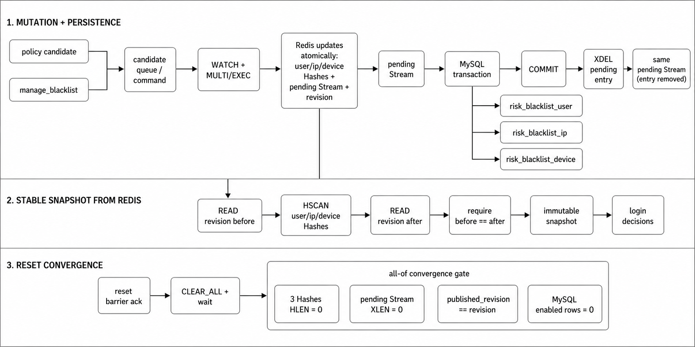

# AegisFlow C++实时风控决策引擎：架构说明

AegisFlow 把网络所有权、领域计算和存储副作用分开：EventLoop 独占连接与 Session，business worker 计算 `RiskEvaluation`，单线程 maintenance worker 处理候选、Redis 快照与 MySQL 回写。构建、配置和命令见 [README](../README.md)，按实验理解实现见[学习手册](LEARNING.md)。

## 1. 组件与所有权


```text
main / ProcessSignalWaiter
├── Logger singleton
│   └── bounded deque -> logger thread -> file
├── Timer singleton
│   └── command queue + deadline heap -> TimerEvent
└── Handler singleton
    └── Handler::Impl
        ├── AcceptorLoop
        ├── EventLoopGroup
        │   ├── CompletionRouter
        │   └── N × EventLoop -> Session -> LengthPrefixedCodec
        ├── BoundedWorkerPool (business)
        │   └── LoginBusinessHandler -> RiskService
        ├── BoundedWorkerPool (maintenance, exactly one worker)
        │   ├── FeatureStateMaintenance task
        │   └── BlacklistMaintenance task
        ├── BlacklistCandidateQueue
        └── BlacklistManager -> immutable BlacklistSnapshot
```

| 执行位置 | 独占或保护的资源 | 对外传递 |
|---|---|---|
| main | 配置、信号等待、顶层生命周期 | Logger/Timer/Handler 生命周期调用 |
| logger thread | 日志文件、格式化与 flush | 从有界 `LogRecord` 队列取值 |
| timer thread | `epoll`、`timerfd`、`eventfd`、命令队列、deadline heap | 轻量 `TimerEvent` |
| AcceptorLoop thread | listen fd、全局连接额度、备用 fd | 有界连接移交 |
| EventLoop thread | epoll fd、连接 fd、Session、Codec、三个 mailbox | 自有请求/响应字节与 token |
| business worker | 当前请求 Arena、领域值、响应 payload | `RiskEvaluation` 的候选进入本地队列，completion 回 owner loop |
| maintenance worker | 运行期 Redis connection、`BlacklistRedisStore`、`MysqlDao`、本地 revision | 原子发布快照，确认候选与 Stream |
| Handler init 线程 | 冷启局部 Redis/MySQL connection | 首份快照与 initial revision |
| FeatureStore shard | 一个 user/IP/device map | 分片 mutex 保护 |
| BlacklistManager | 原子 `shared_ptr<const BlacklistSnapshot>` | 请求线程 acquire 读取完整版本 |

运行期 Redis/MySQL connection 只在 maintenance worker 的调用栈中懒创建、复用和失效。EventLoop、business worker 与 `RiskService` 不执行外部存储 I/O。

## 2. 启动依赖与首份快照

顶层按 `Logger → Timer → Handler` 启动。Handler 的 `init()` 在网络组件创建前完成黑名单冷启：

```text
one startup deadline
  -> connect Redis
  -> connect MySQL and set UTC session
  -> read cache_ready + revision
       ready
         -> revision-before -> HSCAN 3 Hashes -> revision-after
       not ready
         -> XRANGE pending batches
         -> MySQL transaction in Stream order
         -> COMMIT -> XDEL
         -> load enabled rows from 3 MySQL tables
         -> WATCH cache_ready + revision
         -> DEL/HSET 3 Hashes + INCR revision + SET cache_ready 1
         -> stable HSCAN
  -> publish immutable snapshot
  -> SET published_revision
```

ready 缺失时，pending Stream 是 MySQL 尚未确认的写后缓冲，必须先收敛。重建 transaction 把 ready 放在最后，其他连接不会把部分 Hash 当作完整缓存。多个启动者发生 WATCH 冲突时，失败者放弃本地 MySQL 候选并读取获胜者发布的 Redis 状态。

首份快照或依赖验证失败会阻止 Acceptor 启动。内存快照已经发布而 `published_revision` 的 `SET` 失败时，Handler 保存 `publication_dirty=true`，开始接入；运行期维护任务继续重试该本地 revision。

Handler 的 `start()` 依次创建 business/maintenance pools、启动 `FeatureStateMaintenance` 与 `BlacklistMaintenance`、启动 EventLoopGroup，最后启动 AcceptorLoop。这样监听端口可接入时，工作线程、Timer sink 和首份快照都已就绪。

## 3. 请求路径


1. AcceptorLoop 在 ET 模式下循环 `accept4` 到 `EAGAIN`，取得全局连接额度后将 fd 移交给负载较低的 EventLoop。
2. owner EventLoop 创建带 generation 的 `ConnectionToken` 和 Session，注册 fd 与连接 deadline。
3. Session 把读取字节交给 `LengthPrefixedCodec`；Codec 恢复 4 字节大端长度头和完整 payload。
4. EventLoop 将自有 payload 提交给有界 business pool。队列满时由 owner loop 写 `OVERLOADED` 响应。
5. `LoginBusinessHandler` 在 worker 的 `thread_local` Protobuf Arena 解析 `LoginRequest`；`LoginRequestValidator` 校验字段并把 IP 规范化，生成可信 `LoginAttempt`。
6. `RiskService::evaluate` 更新 FeatureStore、查询同一份不可变黑名单快照、执行策略链和纯候选规则，返回 `RiskEvaluation { decision, candidates }`。
7. LoginBusinessHandler 对候选逐个 `trySubmit`，再把领域决策映射为 `LoginResponse` payload。队列满不改写决策。
8. CompletionRouter 按 loop id 把自有字节投递回 owner EventLoop；EventLoop 校验 `{loop_id, fd, generation}` 后交给 Session 编帧并写到 `EAGAIN`。

跨线程消息不持有 Session 指针、Arena 对象或借用的输入 `ArrayView`。一次请求遵循“解析输入 → 计算领域结果 → 提交本地副作用 → 编码响应”。

## 4. 网络正确性

### 4.1 长度帧

```text
+--------------------------+-------------------------+
| 4 字节 uint32 大端长度 N | N 字节 Protobuf payload |
+--------------------------+-------------------------+
```

Codec 可以跨多次 read 保存帧头与 payload 进度。长度必须大于零，同时受 `server.max_frame_payload_bytes` 和 1 MiB 硬上限约束。Codec 只恢复消息边界；Protobuf 与业务字段在 worker 边界解析。

### 4.2 ET 推进与 Session 单写者

AcceptorLoop 和 EventLoop 收到边沿触发事件后持续 accept/read/write 到 `EAGAIN`。每个 Session 永远只由一个 EventLoop 修改，网络线程之外的组件只能发送值消息。

Session 主状态为 `Reading → Processing → Writing → Reading`。同一连接仅允许一个 business task 在途，后续字节在配置上限内暂存，所以响应不需要跨请求重排。输入/输出高水位、completion 条数与字节容量、连接额度和 business queue 都有固定上限。

### 4.3 generation token

Linux 可在 close 后复用相同 fd。Session 建立时分配新 generation；completion 和 timeout 必须同时匹配 loop id、fd、generation。旧任务因此不能修改复用该 fd 的新连接。

## 5. 领域计算与特征状态

`RiskService` 依赖具体的 `LoginFeatureStore`、`BlacklistManager`、`LoginPolicyChain` 与无状态 `BlacklistCandidateGenerator`。Proto 类型只出现在 `LoginBusinessHandler`。

```text
LoginAttempt
  -> FeatureStore::updateAndGet
  -> BlacklistManager::matches(snapshot, now_ms)
  -> LoginPolicyChain::evaluate
  -> BlacklistCandidateGenerator::generate
  -> RiskEvaluation
```

策略链固定按黑名单、credential stuffing、user 失败、IP 扫号、device 共享执行，保留全部 `policy_hits`。最终动作取最高严重度，分数取最大值。

候选规则只有一个：`credential_stuffing_attack` 产生最终 REJECT，且 user/IP/device 都未命中黑名单时，生成规范 IP 的 30 分钟 UPSERT。任意 REVIEW 或任一黑名单命中不生成候选。生成器显式接收 `now_ms`，不持有时钟、队列或 connection。

FeatureStore 为 user、IP、device 各保留 64 个分片。一次请求按顺序进入三个分片，但不同时持有两把锁。`SlidingCounter` 保存固定桶；`SlidingDistinct` 保存 `member -> latest_bucket` 和过期 heap，单 key 的 distinct 成员上限为 5000。

`FeatureStateMaintenance` 的 Timer tick 只提交回收任务。回收逐分片锁住 map、直接遍历并删除 TTL 到期状态，循环末尾释放锁。map 是状态的唯一目录，不存在扫描顺序或扫描/删除预算；`currentStats()` 需要时在分片锁内汇总容器与 distinct 成员数。

## 6. 三个进程级单例

Logger、Timer、Handler 处于同一所有权层级。三者都使用显式状态机保护 `init/start/stop/join`，拒绝冲突配置，并保证重复停止或等待不会创建第二套线程、重复释放资源或并发 join 同一对象。

### 6.1 Logger


`Logger::instance()` 拥有一个固定容量 `deque<LogRecord>`、mutex/CV、一个 `std::thread` 和一个 `ofstream`。生产者先按 level 过滤，构造拥有 timestamp、level、thread id、file、line 和 message 的记录，持锁尝试入队；业务线程不格式化或写文件。

日志线程批量交换队列，在自身线程格式化并写入 UTC 时间戳。它在 flush interval、ERROR 记录和停机排空时 flush。队满统一丢弃新记录并累计 `dropped_count`，日志线程下一次成功写记录时写一条增量摘要。

`start()` 创建父目录并打开文件，打开失败使启动失败。运行期 write/flush 错误累计 `io_error_count`，只向 stderr 输出一次短提示，该路径不递归调用 Logger。`stop()` 与入队共用 mutex，建立停止接受边界；`join()` 等已接受记录排空。

### 6.2 Timer


`Timer::instance()` 直接拥有 `TimerCore`、有界 command deque、deadline 最小堆、reservation 表、`eventfd`、`timerfd`、`epoll` 和一条 timer thread。任意调用线程通过 `scheduleAt()` 或 `cancel()` 向有界命令队列提交值；`eventfd` 只负责唤醒，timer thread 批量处理命令后把 `timerfd` 重新设置为最近 deadline。

到期节点只携带 `TimerEvent` 和 `weak_ptr<ITimerSink>`。timer thread 调用 `tryPost()` 把值投递给 owner EventLoop mailbox 或 maintenance task submitter；sink 已销毁时丢弃事件。它不执行 Redis/MySQL I/O，也不扫描 FeatureStore，因此 Logger 的文件线程与 Timer 的调度线程具有同样清晰的单一职责和有界输入。

`command_capacity` 限制尚未处理的 schedule/cancel/stop 命令，`timer_capacity` 限制 reservation 和 heap 中的 live timer。`stop()` 关闭新命令并用 `eventfd` 唤醒 worker；`join()` 防止 self-join，并等待 timer thread 退出后关闭三个 fd。

### 6.3 Handler


`Handler::instance()` 通过 Pimpl 独占 `Handler::Impl`。`init()` 使用局部 Redis/MySQL connection 完成依赖验证、pending 收敛和首份不可变黑名单快照，再创建共享的 `RiskService`、`LoginBusinessHandler` 与有界候选队列；端口此时尚未监听。

`start()` 依次创建有界 business pool、单线程 maintenance pool、两个 Timer sink、EventLoopGroup 和 AcceptorLoop。EventLoop 是 Session 的单写者；business worker 只计算 `RiskEvaluation`、提交本地候选并返回 completion，不访问 Redis/MySQL；maintenance worker 独占运行期连接并按顺序发布快照和回写三表。

Handler 的 queued candidate 与唯一 reserved batch 共用总容量。关闭时先截断 ingress 并排空 business/completion，确认不会再产生候选后关闭队列、取消两个 TimerId，最后在 maintenance pool FIFO 中执行 candidate-only final drain。整个过程使用同一个 shutdown deadline。

## 7. Redis、候选队列与 MySQL



### 7.1 八个 Redis key

`RedisKeySet::fromPrefix` 从 `redis.key_prefix` 生成：

| 后缀 | 类型 | 内容 |
|---|---|---|
| `:user` | Hash | `user_id -> expire_at_ms` |
| `:ip` | Hash | `canonical_ip -> expire_at_ms` |
| `:device` | Hash | `device_id -> expire_at_ms` |
| `:pending` | Stream | 完整 `UPSERT`/`DISABLE`/`CLEAR_ALL` mutation |
| `:revision` | String counter | Redis 热状态版本 |
| `:cache_ready` | String | 完整初始化标记 |
| `:published_revision` | String | 已发布到内存的版本 |
| `:reset_barrier` | Hash | requested/completed 序号 |

三个 Hash 只保存快照判定所需的过期毫秒，`0` 表示永久。reason 只在 pending Stream 与 MySQL 中出现。

### 7.2 原子 mutation

自动候选与 `manage_blacklist add|disable` 共用 `BlacklistRedisStore::applyMutations`：

```text
WATCH cache_ready + pending + revision + touched Hashes
  -> require ready == 1
  -> validate key types and incrementable non-negative revision
  -> MULTI
       HSET/HDEL typed Hash
       XADD pending mutation
       INCR revision
     EXEC
  -> validate every reply and new revision
```

`CLEAR_ALL` 单独要求一个 mutation，并在同一 transaction 内 `DEL` 三个 Hash、`XADD operation=CLEAR_ALL`、`INCR revision`。WATCH 冲突是确定未提交，可以在共同 deadline 内整体重试；EXEC 已发送却没有确定 reply 是 `CommitUnknown`，不能按“未执行”处理。

### 7.3 有界候选缓冲

`BlacklistCandidateQueue` 的容量等于 queued 加 maintenance 唯一 reserved batch。business worker 只执行 mutex 保护的 `trySubmit`，不等待 Redis。Full 增加运行期 dropped counter；Closed 与 Invalid 不混入该计数。

maintenance 每次最多从 queued 取 `blacklist.candidate_batch_size` 条放入 reserved，在批内按 `(type,id)` 去重；重复 UPSERT 保留更晚的 expiry，永久 expiry 优先。只有 Redis transaction 返回 `StoreStatus::Ok` 且带新 revision 才 `acknowledgeReserved()`。任何连接错误、协议错误、deadline、WATCH 冲突或 commit unknown 都保留原批，下次 `reserveBatch()` 优先返回它。

### 7.4 单线程 BlacklistMaintenance

`BlacklistMaintenanceTick` 只提交一项任务。round 在途时，后续 tick 合并为一个 pending bit；当前 round 结束后立即补交一次，不向有界 maintenance pool 堆积重复任务。单 worker 从结构上保证本地 revision、Redis connection 和 MysqlDao 只有一个访问者。

普通 round 共用一个绝对 deadline，顺序是：

1. 读取 reset barrier；无 pending reset 时处理一个 candidate 批次。
2. 读取 Redis revision；revision 变化或过期清理到期时，执行稳定 HSCAN。
3. 发布不可变快照，记录本地 `last_published_revision`。
4. dirty 时尝试写 `published_revision`；失败保持 dirty。
5. `XRANGE ... COUNT blacklist.batch_size` 读取一个 pending 批次，合法 mutation 按 Stream 顺序写入一个 MySQL transaction；commit 后才 `XDEL`。

HSCAN 前后 revision 不同会放弃候选快照。Redis SCAN 允许重复 field，维护核心按 `(type,id)` 折叠相同 expiry；重复 field 的值冲突时放弃该轮。

过期清理到期时，即使 revision 未变也完整扫描。维护任务过滤已过期条目后，用 `WATCH revision` 和相关 Hash，再以 `HGET` 核对每个 field 的扫描值；只有值仍相同且仍过期才在 `MULTI/EXEC` 中 HDEL 并递增 revision。续期或并发写入触发冲突，该轮不删除也不发布过滤快照。

坏 Stream 记录写 ERROR 后 XDEL，避免永久阻塞。MySQL 失败不 XDEL；commit 成功而 XDEL 未完成时，下轮根据实体唯一键幂等重放。Redis/MySQL connection 失败后由 production backend 丢弃，下一命令在 worker 中懒重连。

### 7.5 三张 MySQL 表

| 表 | 实体唯一键 | 存储特点 |
|---|---|---|
| `risk_blacklist_user` | `user_id` | `utf8mb4_bin` 精确文本 |
| `risk_blacklist_ip` | `ip` | `VARBINARY(16)`，IPv4 4 字节、IPv6 16 字节 |
| `risk_blacklist_device` | `device_id` | `utf8mb4_bin` 精确文本 |

三表使用 `BIGINT UNSIGNED AUTO_INCREMENT` 主键和 `(enabled, expire_at, id)` 索引。`MysqlDao::loadEnabledBlacklists()` 只用于 Redis 冷启来源；`applyBlacklistMutations()` 按 Stream 原顺序执行 UPSERT、DISABLE、CLEAR_ALL；`countEnabledBlacklists()` 用于 reset wait 和集成测试。

UPSERT 依赖实体唯一键实现幂等并重新启用已有行，DISABLE 把实体行设为 disabled，CLEAR_ALL 把三表所有 enabled 行设为 false。MySQL session 固定 UTC；`DATETIME(3)` 与 epoch 毫秒通过 `MYSQL_TIME` 精确转换。

## 8. Reset barrier 与完整压测

完整压测的每个 warmup/measurement 组合前，`manage_blacklist clear --all --wait --confirm benchmark-reset` 执行：

```text
HINCRBY reset_barrier requested 1 -> token
  -> wait completed >= token
       maintenance: business inflight first check == 0
       maintenance: drain queued + reserved candidates
       maintenance: business inflight second check == 0 and queue empty
       maintenance: advance completed
  -> CLEAR_ALL Redis transaction
  -> wait 3 Hashes empty
  -> wait pending Stream empty
  -> wait published_revision == revision
  -> wait MySQL 3-table enabled count == 0
```

`BoundedWorkerPool::inflightCount()` 从任务成功入队开始递增，在执行完成、异常完成或排队取消时递减，所以第一次 idle 检查不会漏掉尚未开始执行的业务。第二次检查封住候选排空期间重新出现业务的竞态。压力脚本独占服务流量，barrier ack 与 CLEAR_ALL 之间不会插入新请求。

`scripts/pressure_test.sh` 每轮只调用一次 reset，再调用一次 `benchmark_native` 完成 warmup 和 measurement。reset 非零退出会在发流量前中止。`RESET_CONFIG` 非空时传给管理命令；服务使用非默认配置时，它必须指向同一 Redis prefix 和 MySQL database。

## 9. 生命周期

### 9.1 顶层顺序

```text
start: Logger -> Timer -> Handler
stop:  Handler -> Timer -> Logger
```

Logger 最先启动，因此 Timer 和 Handler 的启停可记录；Logger 最后停止，因此 Handler 的最终候选结果也可记录。

### 9.2 Handler 正常关闭

`Handler::stop()` 只建立关闭意图：停止 Acceptor、让 EventLoop 开始 drain、关闭 business pool 新提交。`Handler::join()` 使用 `server.shutdown_grace_timeout_ms` 计算的同一绝对 deadline：

```text
join Acceptor
  -> drain business pool
  -> drain EventLoop completions
  -> stop/join EventLoops
  -> join business pool
  -> close candidate queue
  -> cancel FeatureStateMaintenance TimerId
  -> cancel BlacklistMaintenance TimerId
  -> enqueue FIFO candidate-only final drain on maintenance pool
  -> close/drain/join maintenance pool
  -> report residual queue-full delta
  -> discard queued + reserved once if deadline expired
```

final drain 排在已经接受的普通维护任务之后，并使用 maintenance pool 传入的 `CancellationToken`，不使用已经请求停止的周期维护 `CancellationToken`。Redis 仍不可用或 deadline 已到时，残余候选由 `discardRemainingOnShutdown()` 在同一把队列锁内清空并只计一次；Handler 记录一条 ERROR 并返回 JoinFailed。

部分启动失败使用同一个关闭时限反向停止已经创建的组件。`stop()`、`join()` 和单例状态通过 mutex/CV 保证重复调用不会创建第二套线程或并发 join 同一资源。

## 10. 配置所有权

`AppConfig` 只接受 45 个外部键，完整默认值与含义见 [README 的服务配置](../README.md#服务配置)。分组如下：

| 分组 | 实际 key |
|---|---|
| Logger | `log.level`、`log.file`、`log.queue_capacity`、`log.flush_interval_ms` |
| 服务 | `server.host`、`server.port`、`server.io_threads`、`server.max_connections`、`server.max_frame_payload_bytes`、`server.idle_timeout_ms`、`server.io_timeout_ms`、`server.business_timeout_ms`、`server.shutdown_grace_timeout_ms` |
| business pool | `worker_pool.threads`、`worker_pool.queue_capacity` |
| 特征回收 | `maintenance.interval_ms`、`maintenance.user_state_ttl_ms`、`maintenance.ip_state_ttl_ms`、`maintenance.device_state_ttl_ms` |
| 策略 | `policy.user_failure_review_threshold`、`policy.ip_spray_review_threshold`、`policy.device_sharing_review_threshold`、`policy.ip_distinct_reject_threshold`、`policy.ip_failure_reject_threshold` |
| MySQL | `mysql.host`、`mysql.port`、`mysql.user`、`mysql.password`、`mysql.database` |
| 黑名单 | `blacklist.startup_timeout_ms`、`blacklist.batch_size`、`blacklist.reset_timeout_ms`、`blacklist.maintenance_interval_ms`、`blacklist.maintenance_timeout_ms`、`blacklist.expire_cleanup_interval_ms`、`blacklist.candidate_queue_capacity`、`blacklist.candidate_batch_size` |
| Redis | `redis.host`、`redis.port`、`redis.username`、`redis.password`、`redis.database`、`redis.connect_timeout_ms`、`redis.command_timeout_ms`、`redis.key_prefix` |

maintenance pool 固定一条线程和 64 个任务容量，不暴露配置分支。Timer 命令容量和 timer 容量从 business queue、IO thread 与最大连接数推导。未知键、重复键、非法容量和跨字段冲突在组件启动前失败。

## 11. 源码目录

| 路径 | 内容 |
|---|---|
| `proto/login.proto` | 请求、响应、动作、状态和 policy hit |
| `src/main.cpp` | 信号与 Logger/Timer/Handler 顶层生命周期 |
| `src/config/config.cpp` | 45 键解析、默认值与跨字段校验 |
| `src/net/` | Acceptor、EventLoop、Session、Codec、mailbox、业务协议边界 |
| `src/app/risk_service.cpp` | 特征、快照、策略和候选的领域编排 |
| `src/feature/` | 滑动窗口、分片状态与直接冷回收 |
| `src/risk/` | 策略链、快照、mutation 与候选规则 |
| `src/app/blacklist_candidate_queue.cpp` | queued/reserved 有界队列与丢弃计数 |
| `src/app/blacklist_cache_bootstrap.cpp` | pending 收敛、MySQL 冷启与首份 Redis 快照 |
| `src/app/blacklist_maintenance.cpp` | 单线程维护状态机、barrier、快照、Stream 与 final drain |
| `src/app/blacklist_maintenance_backend.cpp` | worker-owned Redis/MySQL production adapter |
| `src/storage/blacklist_redis_store.cpp` | Redis key、WATCH/MULTI/EXEC、HSCAN、Stream 与 barrier |
| `src/storage/mysql_dao.cpp` | 三表 prepared statement、UTC 与事务 |
| `src/log/logger.cpp` | 有界异步 Logger |
| `src/runtime/bounded_worker_pool.cpp` | business/maintenance 执行器与 inflight |
| `src/timer/` | Timer singleton、TimerCore 和轻量事件投递 |
| `src/benchmark/` | 帧客户端、请求调度、指标和摘要 |
| `cmake/AegisFlowServiceSources.cmake` | 服务与测试复用的生产源文件清单 |
| `cmake/AegisFlowProject.cmake` | 服务和运维客户端 target |
| `cmake/AegisFlowBenchmark.cmake` | 原生压测与 FeatureStore 微基准 target |
| `cmake/AegisFlowTests.cmake` | 25 个模块测试 target 与 28 个 CTest 注册 |
| `tests/` | 25 个按模块命名的测试文件 |

## 12. 测试结构

每个测试文件只保护一个模块或一类完整功能，CMake 为 25 个文件建立独立 target，并注册 28 个 CTest 名称。`scripts/test.sh <module>` 构建目标并运行同名测试；`scripts/test.sh all` 构建全部模块 target 并运行全部 CTest。完整 module 列表和外部依赖变量见 [README 的模块测试](../README.md#模块测试)。

顶层 `CMakeLists.txt` 只生成公共 Proto target 并按 `AEGISFLOW_BUILD_PROJECT`、`AEGISFLOW_BUILD_BENCHMARK`、`AEGISFLOW_BUILD_TESTS` 选择一个或多个构建组。日常脚本为三个组使用不同的仓库外 binary directory：项目编译不会配置测试或压测 target，benchmark-only 配置也不会查找 MySQL/hiredis。测试组只生成模块测试及其直接依赖，不生成 `AegisFlow`、`benchmark_native` 或 `benchmark_feature_store`。

关键契约分别由 `test_login_business_handler`、`test_blacklist_candidate_generator`、`test_blacklist_candidate_queue`、`test_blacklist_maintenance`、`test_manage_blacklist`、`test_lifecycle`、`test_benchmark_reset` 和 Redis/MySQL storage tests 覆盖。外部依赖只由显式环境变量启用；专用 MySQL mutation 测试还要求 `AEGISFLOW_TEST_MYSQL_ALLOW_MUTATION=dedicated-test-database`。
