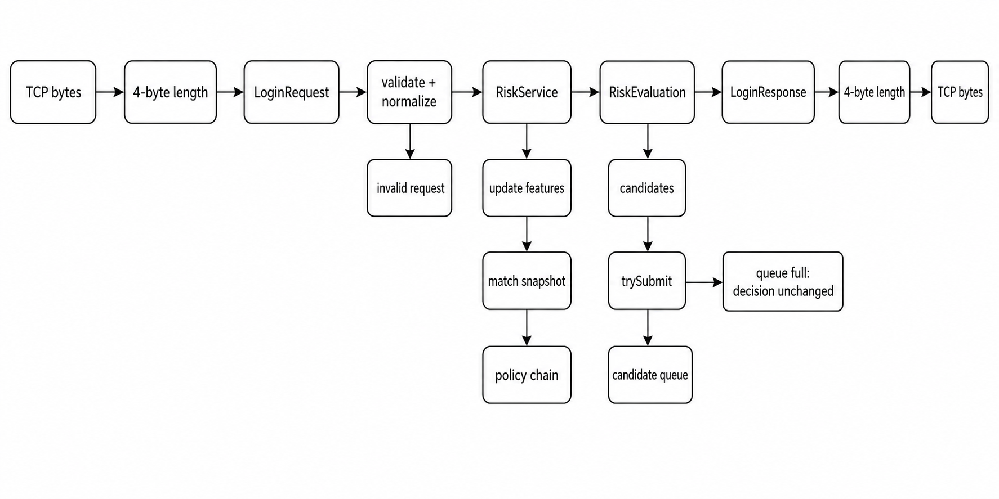
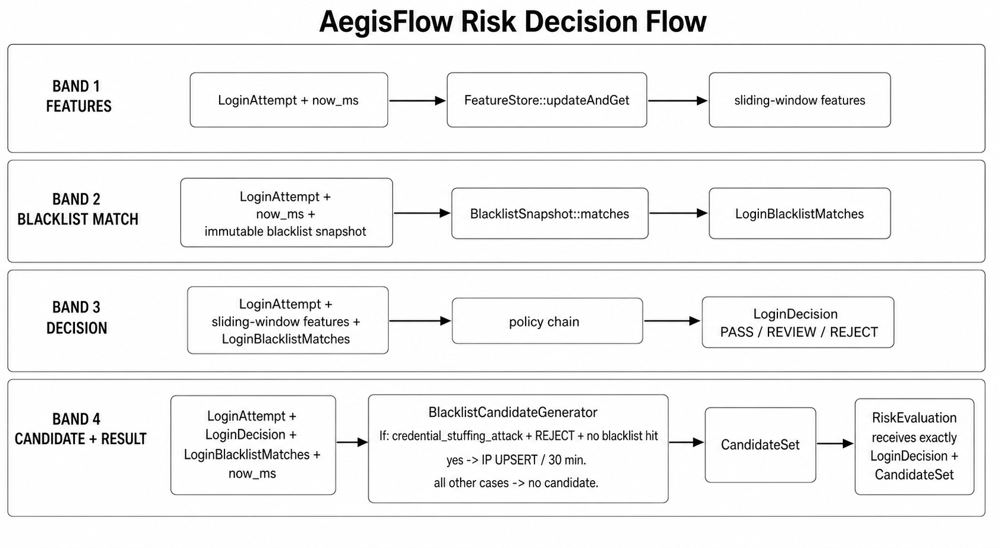
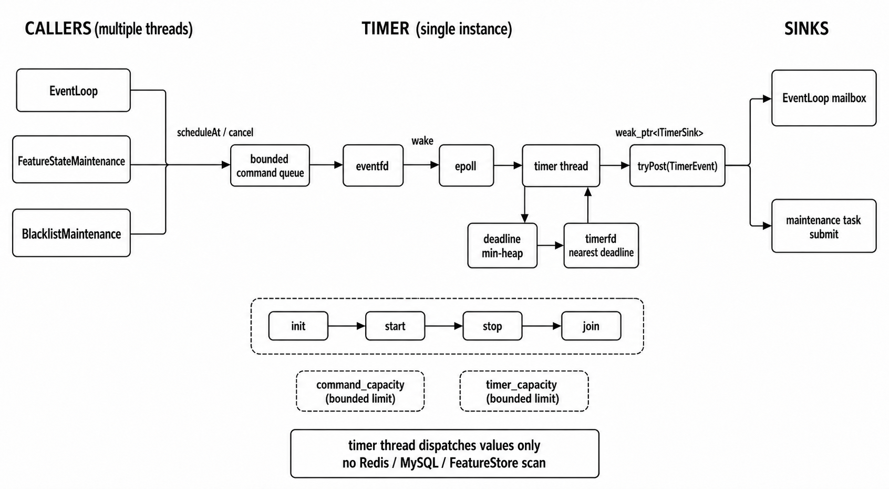
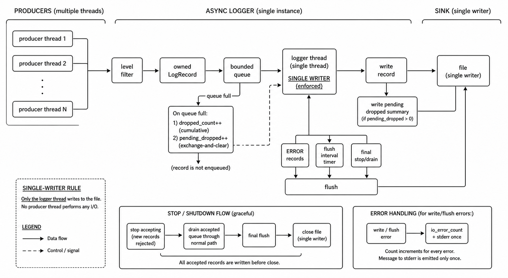
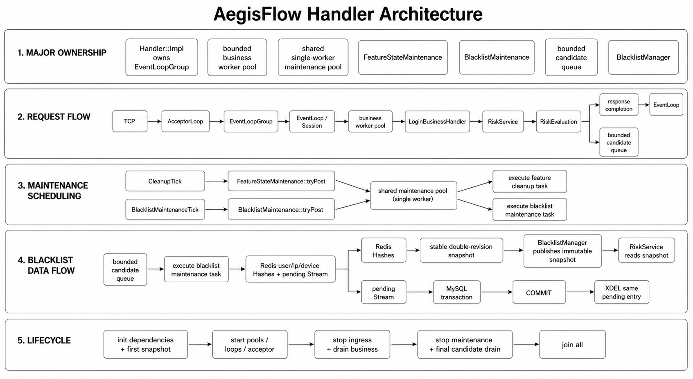
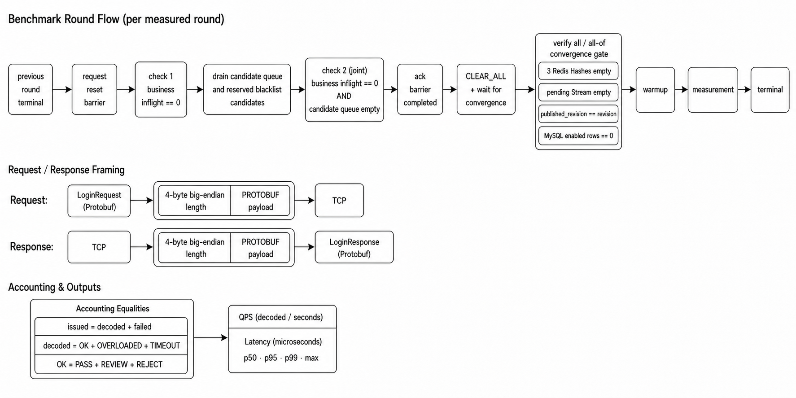

# AegisFlow C++实时风控决策引擎：学习手册

这份手册沿一条登录请求和一条黑名单 mutation 阅读项目：先理解字节怎样成为领域值，再理解决策怎样产生候选，最后跟随候选经过 Redis、MySQL 和不可变快照。构建与命令见 [README](../README.md)，组件所有权见[架构说明](ARCHITECTURE.md)。

## 1. 从字节到领域值



### 1.1 TCP 没有消息边界

TCP 只提供有序字节流，一次 `send` 不对应一次 `recv`。项目用固定帧格式恢复消息：

```text
+--------------------------+-------------------------+
| 4 字节 uint32 大端长度 N | N 字节 Protobuf payload |
+--------------------------+-------------------------+
```

`LengthPrefixedCodec` 先累计 4 字节头，再按 N 累计 payload；半包和粘包只是进度不同。N 为零、超过 `server.max_frame_payload_bytes` 或超过 1 MiB 协议硬上限时，在分配巨型 payload 前拒绝。

可以从以下文件顺序阅读：

1. `include/aegisflow/net/protocol_contract.hpp`：4 字节头和硬上限；
2. `src/net/length_prefixed_codec.cpp`：分片输入如何推进；
3. `proto/login.proto`：payload 的 Protobuf schema；
4. `src/net/session.cpp`：完整 payload 如何进入业务状态。

### 1.2 Protobuf 解析不等于业务可信

`LoginRequest::ParseFromArray` 只证明字节符合 wire format。`LoginRequestValidator` 还要求 optional 字段显式存在、user/device 不为空且不超过 128 字节、IP 输入不超过 45 字节、时间戳不在未来且历史严格小于 1 小时、result 为 `SUCCESS` 或 `FAIL`。

`attempt_id=0` 可以合法，但必须显式存在。这个例子说明 proto3 optional presence 与数值默认值是两件事。

IP 校验通过后立即进入 `IpAddress`：`inet_pton` 生成 4/16 字节网络序，`inet_ntop` 生成规范文本，IPv4-mapped IPv6 收敛为 IPv4。登录匹配、Redis field、CLI mutation 和 MySQL 二进制列都复用这一个结果，避免同一地址因文本写法不同而漏判。

### 1.3 Proto 留在协议层

`LoginBusinessHandler` 解析 Proto 并构造 `LoginAttempt`，`RiskService` 只接受领域值并返回：

```cpp
RiskEvaluation {
    LoginDecision decision;
    std::vector<BlacklistMutation> candidates;
}
```

候选提交以后，LoginBusinessHandler 再把 `LoginDecision` 映射为 `LoginResponse`。因此领域服务不依赖 Protobuf，也不隐藏队列或存储副作用。

## 2. epoll ET、Session 与异步结果

### 2.1 ET 是“推进到 EAGAIN”的义务

边沿触发通知状态发生变化。Acceptor 收到监听事件后循环 `accept4` 到 `EAGAIN`；EventLoop 对连接 fd 循环 read/write 到 `EAGAIN`。如果读一点就返回，内核缓冲区仍有数据，但新的边沿不一定再来。

项目把系统调用循环集中在 `AcceptorLoop` 和 `EventLoop`，Session 只维护协议字节与状态。这样可以分别测试 ET 推进和业务状态机。

### 2.2 Session 只有一个写者

一个 Session 从创建到销毁都归同一 EventLoop 线程所有。business worker 不拿 Session 指针，只返回自有 completion 字节。Timer 也只投递 timeout 值事件，最终状态变化仍由 owner EventLoop 完成。

主状态是：

```text
Reading -> Processing -> Writing -> Reading
```

同一连接只有一个业务请求在途，所以响应天然保持请求顺序；Processing/Writing 期间到达的字节只在输入容量内暂存。

### 2.3 generation 解决 fd 复用

fd 是可复用整数。旧业务完成时，同一个 fd 可能已属于新连接。每次 Session 创建都分配新的 generation，completion 和 timeout 携带 `{loop_id, fd, generation}`；三者全部匹配才接收。generation 把“同一个整数 fd”变成“这一次连接身份”。

### 2.4 mailbox 和反压

连接移交、completion 条数、completion 字节、Session 输入/输出、business queue、Timer 命令和连接总数都有上限。队列满不是无限扩容信号，而是显式状态：连接移交可拒绝、business queue 返回 `OVERLOADED`、Session 超过硬上限则关闭。

`BoundedWorkerPool` 从任务成功入队开始递增 `inflight_`，在正常完成、异常完成或 deadline 取消排队任务时递减。这个计数既用于排空，也让 reset barrier 看见尚未被 worker 取走的任务。

## 3. 特征、策略与 RiskEvaluation



### 3.1 先更新，再在同一时点求值

`RiskService::evaluate` 先调用 `FeatureStore::updateAndGet(attempt, now_ms)`，所以第 N 次失败达到阈值时，第 N 次请求立即命中。

| 特征 | 结构与更新语义 |
|---|---|
| `user_login_fail_5m` | `SlidingCounter<60>`，5 秒桶；只由窗口内失败更新 |
| `ip_distinct_failed_user_10m` | `SlidingDistinct`，10 秒桶；只记录失败 user |
| `ip_login_failures_10m` | `SlidingCounter<60>`，10 秒桶；只记录失败 |
| `device_distinct_account_10m` | `SlidingDistinct`，10 秒桶；记录窗口内账号 |

成功登录可以读取已有 user/IP 失败状态，但不会创建或延长它。每个 distinct key 最多保留 5000 个成员。

`SlidingCounter` 只累加窗口内桶。`SlidingDistinct` 用 `member -> latest_bucket` 保存最新出现，并用最小 heap 清理过期项；heap 中的桶只有仍等于 map 最新桶时才删除成员，因此成员刷新不会被过期 heap 项误删。

### 3.2 冷状态直接按分片回收

FeatureStore 对 user、IP、device 分别使用 64 个 shard。`reclaimColdStates(now_ms)` 逐个 shard 加锁，直接迭代 map 并用 iterator `erase` 删除 TTL 到期项；一次只持有一把锁。

map 本身就是状态目录。直接遍历避免维护第二套扫描顺序，也没有扫描预算、删除预算或登录热路径镜像计数。`currentStats()` 是诊断操作，需要时才在分片锁内遍历 map 并调用 `activeMemberCount()` 汇总 distinct 成员。

### 3.3 策略全部执行

策略固定按以下顺序追加 hit：

1. `blacklisted_user`、`blacklisted_ip`、`blacklisted_device`；
2. `credential_stuffing_attack`；
3. `too_many_failed_login`；
4. `ip_many_users_failed_login`；
5. `device_many_accounts`。

链不会在首个命中后短路。最终动作取最严重的 `PASS < REVIEW < REJECT`，风险分取最大值，全部 `policy_hits` 留给响应和 benchmark 统计。

### 3.4 为什么只自动封禁 credential stuffing IP

`BlacklistCandidateGenerator` 是纯对象，输入相同的 attempt、decision、blacklist matches 和 `now_ms` 就产生相同结果。它只在以下条件同时满足时生成 IP UPSERT：

- policy hits 中包含 REJECT 的 `credential_stuffing_attack`；
- 最终动作是 REJECT；
- user、IP、device 都没有黑名单命中；
- `now_ms + 30 分钟` 不溢出 mutation 时间上限。

reason 保留 `credential_stuffing_attack`，expiry 严格等于 `now_ms + 30 分钟`。REVIEW 表示需要观察，不自动升级为封禁；已有黑名单命中时也不重复产生候选。

## 4. 有界候选队列隔离业务与 Redis

`BlacklistCandidateQueue` 使用一个 mutex 保护 queued deque、唯一 reserved batch、关闭标记和计数。容量不只计算 queued，也计算 maintenance 已取走但尚未持久化确认的 reserved。

```text
business worker: trySubmit
  Accepted -> queued
  Full     -> dropped++，decision 不变
  Closed   -> 停机后不接收

maintenance worker: reserveBatch
  existing reserved -> 原批重试
  no reserved       -> 从 queued 取最多 candidate_batch_size
                    -> 按 (type,id) 去重
  Redis success + new revision -> acknowledgeReserved
```

Redis 长时间失败时，reserved 不会被重新塞回队尾，也不会从 queued 继续取新批，顺序和容量都保持稳定。Full 的累计值由单 maintenance 消费者按 tick 取增量，只写一条 WARN 摘要，避免攻击洪峰产生逐请求日志。

停机 final drain 后仍剩余的 queued + reserved 在同一把锁内一次清空并累计 `dropped_on_shutdown`；重复调用返回零，不会重复计数。

## 5. Redis mutation 与乐观事务

### 5.1 八个 key 各自回答一个问题

以默认前缀为例：

| Key | 问题 |
|---|---|
| `aegisflow:blacklist:user` | 哪些 user 在热黑名单中 |
| `aegisflow:blacklist:ip` | 哪些规范 IP 在热黑名单中 |
| `aegisflow:blacklist:device` | 哪些 device 在热黑名单中 |
| `aegisflow:blacklist:pending` | 哪些变更尚未由 MySQL commit 确认 |
| `aegisflow:blacklist:revision` | Redis 热状态是哪个版本 |
| `aegisflow:blacklist:cache_ready` | 三个 Hash 是否完整初始化 |
| `aegisflow:blacklist:published_revision` | 内存快照追到哪个版本 |
| `aegisflow:blacklist:reset_barrier` | benchmark reset 的 requested/completed 序号 |

登录只读内存快照。Hash value 只需要 expiry；reason 留在 Stream 与 MySQL，避免热路径搬运不用的数据。

### 5.2 WATCH 保护读后写条件

管理命令和自动候选都调用 `BlacklistRedisStore::applyMutations`。它先 WATCH ready、pending、revision 与本批触及的 Hash，再检查：ready 是否为 1、key 类型是否正确、revision 是否为可继续 INCR 的非负整数。

```text
WATCH ...
read + validate preconditions
MULTI
  HSET/HDEL
  XADD pending
  INCR revision
EXEC
validate every EXEC element
```

WATCH 的价值不是“锁住 Redis”，而是在 EXEC 时验证读过的条件没有变化。EXEC 返回 nil 表示确定未提交的冲突，可以重新读取后重试。EXEC 已经发送却收不到确定 reply 是 `CommitUnknown`：服务不能假定未执行，candidate reserved 保留，connection 作废，后续依靠重新读状态和幂等语义收敛。

ready、Hash、Stream、revision 的类型和每个 QUEUED/EXEC reply 都要检查。Redis runtime ERROR 不能被一个外层“EXEC 返回数组”掩盖。

### 5.3 CLEAR_ALL 也是有序 mutation

clear transaction 不是三次独立删除：

```text
MULTI
  DEL user ip device Hashes
  XADD pending operation=CLEAR_ALL
  INCR revision
EXEC
```

其他连接只能看见清理前或清理后的完整 Redis 状态。Stream 中 CLEAR_ALL 排在先前 mutation 之后；MySQL 按 Stream 顺序执行时，它会 disable 三表现有 enabled 行，后续 UPSERT 又可以重新启用实体。

## 6. revision、HSCAN 与不可变快照

`BlacklistManager` 保存普通 `std::shared_ptr<const BlacklistSnapshot>`。维护线程在发布锁外完整构造 candidate snapshot，再用 `std::atomic_store_explicit` 以 release 语义发布；请求线程用 `std::atomic_load_explicit` acquire 读取后，user/IP/device 三类匹配来自同一版本。

Redis `HSCAN` 不是快照操作，所以 `loadStableSnapshot` 读取：

```text
revision_before
  -> HSCAN user until cursor 0
  -> HSCAN ip until cursor 0
  -> HSCAN device until cursor 0
revision_after
```

两次 revision 不同就丢弃扫描结果。SCAN 还允许重复 field；维护核心按 `(type,id)` 折叠相同 expiry，若重复值不同则整轮放弃。

普通 tick 在 revision 等于本地已发布版本时不重复 HSCAN。发布成功后先更新本地 revision，再尝试 `SET published_revision`。这个 SET 只给管理命令和压测观察，不参与热路径匹配；失败时 `publication_dirty` 保留，后续即使 revision 没变化也继续 SET，而不重复扫描。

快照查询仍以 `now_ms` 判断 expiry，所以时间推进本身就会让到期条目停止命中，不需要等待 revision 改变。

### 6.1 过期删除为什么再次 WATCH

周期清理到期时，即使 revision 未变也做稳定 HSCAN。扫描后某个 field 可能已经续期，因此删除前还要：

1. WATCH revision 与相关 Hash；
2. GET revision，必须等于扫描 revision；
3. HGET 每个待删 field，必须仍等于扫描 expiry 且仍已过期；
4. MULTI 中 HDEL 并 INCR revision；
5. transaction 成功后发布过滤后的 snapshot。

任一 field 被续期、删除或替换都让整批冲突，本轮既不删除，也不发布基于旧值过滤的快照。

## 7. pending Stream 与 MySQL 事务

Redis transaction 让热 Hash 和 pending mutation 同时可见，但 MySQL 是另一个系统，无法加入同一个原子提交。项目把 Stream 当作写后缓冲：

```text
XRANGE pending - + COUNT batch_size
  -> parse mutations in Stream order
  -> BEGIN
  -> prepared UPSERT / DISABLE / CLEAR_ALL
  -> COMMIT
  -> XDEL committed stream ids
```

MySQL 失败或 commit 未确认时不 XDEL。commit 成功而 XDEL 失败会重放，但三表实体唯一键让 UPSERT/DISABLE 幂等，CLEAR_ALL 重放也只把 enabled 再设为 false。无法解析的 Stream 记录没有可执行领域含义，写 ERROR 后 XDEL，避免永久卡住合法记录。

`MysqlDao` 保持 Pimpl，只公开三组窄操作：加载 enabled 黑名单、按顺序应用 mutation、统计 enabled 行。运行期 connection 由 maintenance worker 独占；失败后丢弃 Dao，下一轮重连。

### 7.1 为什么拆成三张表

`risk_blacklist_user`、`risk_blacklist_ip`、`risk_blacklist_device` 让表名和实体唯一键直接表达类型，不需要每条查询再过滤通用 `entity_type`。user/device 使用 `utf8mb4_bin` 精确文本，IP 使用 `VARBINARY(16)` 保存网络序字节。

每表使用紧凑的 `BIGINT UNSIGNED` 自增主键、实体 UNIQUE 和 `(enabled, expire_at, id)` 索引。冷启查询过滤：

```sql
WHERE enabled = TRUE
  AND (expire_at IS NULL OR expire_at > UTC_TIMESTAMP(3))
```

`EXPLAIN` 的 `possible_keys`、实际 `key` 和估算 `rows` 要结合数据分布解释。小表选择全表扫描可以合法，测试不使用 `FORCE INDEX` 伪造结论。

### 7.2 UTC 与 deadline

MySQL `DATETIME(3)` 不携带时区。Dao 连接后设置 `time_zone='+00:00'`，用 `MYSQL_TIME` 在 epoch 毫秒与年月日时分秒之间转换；`.123` 毫秒对应 `second_part=123000` 微秒。

启动、管理命令和每轮维护都从入口计算一个绝对 steady-clock deadline，并把同一时点传给 Redis/MySQL。mysqlclient 是同步 API，Dao 把 connect/read/write timeout 压到剩余预算，并在 query、statement、fetch、transaction 边界前后检查 deadline。调用方不会为后续阶段重新获得一整份 timeout。

## 8. Timer 只投递轻任务



Timer singleton 用 `timerfd` 等最近 deadline，用 `eventfd` 唤醒跨线程命令，并在一条 timer thread 中维护 heap。Timer thread 不执行 Redis、MySQL 或 FeatureStore 全扫描。

`scheduleAt()` 和 `cancel()` 不直接修改 heap，而是向受 mutex 保护的有界 command deque 提交值，再写 `eventfd`。timer thread 被 `epoll` 唤醒后批量处理命令，清理取消或 generation 不匹配的旧节点，再把 `timerfd` 设置为新的最近 deadline。`command_capacity` 和 `timer_capacity` 分别限制命令积压与 live reservation；这与 Logger 的有界记录队列一样，把过载变成显式返回值。

到期时 Timer 只通过 `weak_ptr<ITimerSink>::tryPost(TimerEvent)` 交付值。EventLoop mailbox 或维护组件决定后续行为，Timer 不取得 Session、Redis connection、MysqlDao 或 FeatureStore 所有权。

`FeatureStateMaintenance` 收到 `CleanupTick` 后向 maintenance pool 提交回收任务；已有回收在途时合并 tick。`BlacklistMaintenance` 收到 `BlacklistMaintenanceTick` 后也只提交任务；已有 round 时把任意数量 tick 合并为一个 pending bit，round 完成后立即补交一次。

maintenance pool 固定为一条 worker。这样 FeatureStore 回收、Redis transaction、snapshot publish 和 MySQL transaction 有明确顺序，运行期 connection 不需要跨线程 mutex。

## 9. Reset barrier 补齐“客户端结束”和“服务端静默”的差距

客户端收到响应，只证明 decision 已编码；候选可能仍在 business task 尾部、candidate queued 或 reserved batch 中。此时直接 CLEAR_ALL，晚到候选可能在清理后重新写入黑名单。

服务侧 barrier 使用 business pool 的真实 `inflightCount()`：

```text
requested > completed
  -> first inflight == 0
  -> drain all queued + reserved candidates
  -> second inflight == 0
  -> candidate queue empty
  -> set completed = requested token
```

第一次检查确认已接受业务不再产生候选；排空覆盖超过一个 candidate batch 的积压与 Redis 失败保留的 reserved；第二次检查关闭排空期间重新出现业务的竞态。完整压力脚本独占流量，拿到 ack 后才允许 CLEAR_ALL。

`manage_blacklist --wait` 在同一个 `blacklist.reset_timeout_ms` deadline 内继续验证：三个 Hash 的 HLEN 为零、pending XLEN 为零、`published_revision == revision`、MySQL 三表 enabled count 为零。固定 sleep 不能表达这些条件。

## 10. Logger、Handler 与顶层生命周期



Logger 的数据所有权是：生产者构造拥有字符串的 `LogRecord`，有界 deque 拥有待写记录，logger thread 独占 `ofstream`。文件 I/O 因此不发生在业务线程。

队满统一丢新记录并累计 dropped；日志线程下一次成功写记录时输出一次摘要。ERROR、flush interval 和停机排空触发 flush。运行期 I/O 错误只累计并向 stderr 提示一次，避免 Logger 递归记录自身失败。



Handler::Impl 把组件所有权集中在一个进程级状态机中：冷启阶段先验证 Redis/MySQL 并发布首份快照；运行阶段拥有 Acceptor、EventLoopGroup、business pool、单线程 maintenance pool、候选队列和两个 Timer sink。EventLoop 单写 Session，business worker 只计算领域结果，maintenance worker 才持有外部存储连接。

因此三个单例的边界是对称的：Logger 的专属线程消费日志队列，Timer 的专属线程消费调度命令并投递值，Handler 编排网络与 worker 组件但不把 Session 或 connection 跨线程共享。

顶层顺序：

```text
start: Logger -> Timer -> Handler
stop:  Handler -> Timer -> Logger
```

Handler 正常关闭先停 Acceptor 和 business 新提交，排空已接受业务与 EventLoop completion。business worker 不再产生候选后，Handler 关闭候选队列并取消两个维护 TimerId；candidate-only final task 被追加到单线程 maintenance pool，FIFO 排在已接受维护任务之后。最终再关闭/排空/join maintenance pool。所有阶段共享 `server.shutdown_grace_timeout_ms` 对应的同一绝对 deadline。

Logger 最后 stop/join，所以 Handler 的候选排空、queue-full 摘要和 `dropped_on_shutdown` ERROR 仍能写入文件。

## 11. 原生 benchmark 怎样形成可对账结果



`benchmark_native` 先把 `LoginRequest` 序列化，加 4 字节大端头，通过 TCP 发送；响应读取完整帧后用 `LoginResponse::ParseFromArray` 解码。客户端内存中保存计数和端到端延迟，只向 stdout 输出一行 `key=value`。

warmup 是独立 phase。它的线程全部 join、每个请求进入响应或失败终态后，measurement 才重新记录起点。截止时仍未收敛的请求进入 request-timeout 失败分类，不保留无法对账的“in progress”。

```text
issued_requests = decoded_responses + failed_requests
decoded_responses = status_ok + status_overloaded + status_timeout
status_ok = action_pass + action_review + action_reject

qps = decoded_responses / measurement_seconds
```

OVERLOADED 和 TIMEOUT 是成功解析的服务响应，属于 decoded；失败分类完整区分 connect、connect timeout、send、read、peer closed、protocol、parse、attempt mismatch、request timeout 与 internal。P50/P95/P99/max 只统计已解码响应的端到端延迟。

`scripts/pressure_test.sh` 从 smoke、steady、attack、churn、overload、deadline 中选择场景，每个选中场景运行至少三轮。每个 warmup/measurement 组合前只调用一次同步 reset；失败就不启动 benchmark。每轮生成新的 entity prefix 和 attack IP，避免 5/10 分钟 FeatureStore 状态跨轮复用。脚本在内存中保存摘要并打印中位数，不写 JSON/CSV 报告。`overload` 要求小于突发量的 business queue；`deadline` 要求 `DEADLINE_PORT` 上的专用服务使用 `server.business_timeout_ms=1`，两者不能在默认服务配置上被假定为必然通过。

服务使用非默认配置时，`RESET_CONFIG` 必须指向同一配置，确保 clear 操作连接同一 Redis prefix 与 MySQL database：

```bash
PROJECT_BUILD_DIR=/tmp/aegisflow-build-$UID/project-release \
BENCHMARK_BUILD_DIR=/tmp/aegisflow-build-$UID/benchmark-release \
RESET_CONFIG=config/server.conf \
ROUNDS=3 \
  ./scripts/pressure_test.sh
```

直接运行 `benchmark_native` 是协议与指标实验，不包含存储复位。

## 12. 配置怎样进入组件

`src/config/config.cpp` 只接受 45 个白名单键，完整默认值见 [README](../README.md#服务配置)。阅读时可按所有权分组：

| 所有者 | 实际配置键 |
|---|---|
| Logger | `log.level`、`log.file`、`log.queue_capacity`、`log.flush_interval_ms` |
| Acceptor/EventLoop/Session | `server.host`、`server.port`、`server.io_threads`、`server.max_connections`、`server.max_frame_payload_bytes`、`server.idle_timeout_ms`、`server.io_timeout_ms`、`server.business_timeout_ms`、`server.shutdown_grace_timeout_ms` |
| business pool | `worker_pool.threads`、`worker_pool.queue_capacity` |
| FeatureStore maintenance | `maintenance.interval_ms`、`maintenance.user_state_ttl_ms`、`maintenance.ip_state_ttl_ms`、`maintenance.device_state_ttl_ms` |
| LoginPolicyChain | `policy.user_failure_review_threshold`、`policy.ip_spray_review_threshold`、`policy.device_sharing_review_threshold`、`policy.ip_distinct_reject_threshold`、`policy.ip_failure_reject_threshold` |
| MysqlDao | `mysql.host`、`mysql.port`、`mysql.user`、`mysql.password`、`mysql.database` |
| blacklist bootstrap/maintenance/CLI | `blacklist.startup_timeout_ms`、`blacklist.batch_size`、`blacklist.reset_timeout_ms`、`blacklist.maintenance_interval_ms`、`blacklist.maintenance_timeout_ms`、`blacklist.expire_cleanup_interval_ms`、`blacklist.candidate_queue_capacity`、`blacklist.candidate_batch_size` |
| Redis connection/store | `redis.host`、`redis.port`、`redis.username`、`redis.password`、`redis.database`、`redis.connect_timeout_ms`、`redis.command_timeout_ms`、`redis.key_prefix` |

`maintenance.interval_ms` 只控制特征冷状态回收；黑名单使用 `blacklist.maintenance_interval_ms`。`blacklist.batch_size` 同时进入冷启 HSCAN/Stream 和运行期 HSCAN/Stream；candidate batch 必须不大于 candidate queue capacity。maintenance pool 固定一条线程，Timer 容量从连接数和 business queue 推导，没有额外外部 key。

构建也按所有权拆成三组。`./scripts/build.sh project` 只配置服务、`send_event` 和 `manage_blacklist`；`./scripts/build.sh benchmark` 使用另一个 binary directory，只配置 `benchmark_native`、FeatureStore 微基准及公共 Proto；`scripts/test.sh` 再使用独立 Debug 目录，只配置模块测试。对应 target 定义分别在 `cmake/AegisFlowProject.cmake`、`cmake/AegisFlowBenchmark.cmake`、`cmake/AegisFlowTests.cmake`，所以修改项目代码后的普通编译不会顺带构建全部测试和压测客户端。

## 13. 阅读顺序与可重复实验

推荐源码顺序：

| 次序 | 文件 | 关注问题 |
|---:|---|---|
| 1 | `proto/login.proto`、`src/app/login_request_validator.cpp`、`src/domain/ip_address.cpp` | 外部输入怎样成为可信领域值 |
| 2 | `src/feature/feature_store.cpp`、`src/risk/login_policy_chain.cpp`、`src/risk/blacklist_candidate_generator.cpp` | 特征怎样形成 decision 和 candidate |
| 3 | `src/net/length_prefixed_codec.cpp`、`src/net/session.cpp` | 任意字节分片怎样保持请求顺序 |
| 4 | `src/net/event_loop.cpp`、`src/net/completion_router.cpp` | IO → worker → IO 怎样保持单写者和 token |
| 5 | `src/app/blacklist_candidate_queue.cpp`、`src/storage/blacklist_redis_store.cpp` | 有界 reserved 与 Redis 原子 mutation |
| 6 | `src/app/blacklist_maintenance.cpp`、`src/app/blacklist_maintenance_backend.cpp` | barrier、revision、Stream 和 connection 所有权 |
| 7 | `src/storage/mysql_dao.cpp`、`config/schema.sql` | 三表、UTC、prepared statement 和幂等事务 |
| 8 | `src/log/logger.cpp`、`src/app/handler.cpp`、`src/main.cpp` | 队列所有权与完整生命周期 |
| 9 | `src/benchmark/load_generator.cpp`、`scripts/pressure_test.sh` | 请求终态、逐轮 reset 和指标记账 |

模块实验使用统一入口：

```bash
./scripts/test.sh length_prefixed_codec
./scripts/test.sh login_protocol
./scripts/test.sh feature_store
./scripts/test.sh login_policy
./scripts/test.sh blacklist_candidate_generator
./scripts/test.sh blacklist_candidate_queue
./scripts/test.sh login_business_handler
./scripts/test.sh blacklist_maintenance
./scripts/test.sh manage_blacklist
./scripts/test.sh async_logger
./scripts/test.sh lifecycle
./scripts/test.sh benchmark_metrics
./scripts/test.sh benchmark_reset
./scripts/test.sh all
```

可重复观察：

1. **帧分片**：运行 `length_prefixed_codec` 与 `login_protocol`，观察半头、半 payload、非法长度和非 Protobuf payload。
2. **窗口与冷回收**：运行 `sliding_window`、`feature_store`，验证失败特征、并发更新、逐分片 TTL 删除和按需 stats。
3. **纯候选规则**：运行 `blacklist_candidate_generator`，固定 `now_ms` 检查 30 分钟 expiry、REVIEW 与已有黑名单命中。
4. **业务到队列**：运行 `login_business_handler`，检查 credential stuffing REJECT 入队，以及 Full 时响应仍为原 REJECT。
5. **维护状态机**：运行 `blacklist_maintenance`，检查 reserved 优先、稳定 HSCAN、published 重试、commit 后 XDEL、双 idle barrier、tick 合并和 final drain FIFO。
6. **Redis 事务**：为专用 Redis 设置 `AEGISFLOW_TEST_REDIS_HOST/PORT/DATABASE`，运行 `redis_blacklist_store`，观察 WATCH 冲突、类型校验和 revision。
7. **MySQL 三表**：为专用库设置 README 中的 MySQL 环境变量与 mutation 确认值，运行 `mysql_blacklist`，检查 IPv4/IPv6、UTC 往返、幂等和 EXPLAIN。
8. **冷启与生命周期**：同时设置专用 Redis/MySQL 变量，运行 `blacklist_cache_bootstrap` 与 `lifecycle`，检查 pending 先收敛、ready-last、部分启动失败和重复 stop/join。
9. **完整轮次**：启动真实服务后运行 `pressure_test.sh`，逐轮核对 barrier token、四项 reset 条件、唯一 entity/IP 和三条记账等式。

`scripts/test.sh` 支持的全部 25 个 module 名称与外部环境变量列在 [README 的模块测试](../README.md#模块测试)。缺少显式依赖时，集成分支输出 `SKIP`，不会隐式使用 `server.conf` 写入未知数据库。
